# 2025FPGA创新设计大赛高云选题一设计解析

​	大家好，这里是鹏野嘉途科技，本期是我们赛题解析系列的第一期，这期为大家带来高云赛题一的原创解析。

​	首先我们来看一下本题的设计要求。

**设计要求**：
本题要求使用高云 FPGA（推荐 TangMega138K Pro，TangMega138K，TangMega60K 或 TangPrimer25K）实现全景会议相机。
可以使用双摄像头+超广角镜头(>180 度)，或多摄+广角镜头实现

**基础要求**

1、 同时获取多个摄像头图像，通过标定参数拼接到球面坐标或等距柱状投影，拼缝尽可能小。
2、 通过按键或其它输入设备可以进行视角旋转，将实时解算的矩形画面呈现到HDMI显示器上。

**拓展要求**
1、 实时解算的矩形画面通过 USB 或网口进行传输，实现全景 UVC 摄像头或全景网络摄像头。
2、 可以搭配麦克风阵列，实现自动旋转视角到说话人角度的虚拟云台功能。
3、 除了视角旋转外，也可以实现视角缩放功能，实现类似"小行星"的特效。
4、 其它具有实际意义的功能。

​	全景相机是一种能够拍摄360度全景图像或视频的特殊相机，通过多镜头组合，捕捉周围环境的完整画面。常见应用场景：

1. 全景运动相机

2. 全景会议相机

|          | **全景运动相机** | **全景会议相机** |
| -------- | ---------------- | ---------------- |
| 应用场景 | 室外             | 室内             |
| 防抖要求 | 高               | 低               |
| 麦克风   | 单麦克风         | 多麦克风阵列     |
| 实现难度 | 高               | 低               |

​	对比全景运动相机和全景会议相机，全景会议相机的防抖性能不必像全景运动相机那样高，但全景会议相机要求有麦克风阵列，需要全方位捕获会议室内的声音。总体来讲，全景会议相机的实现难度是没有运动相机大的，因为运动相机的画面太复杂，这对拼接算法的要求更高。

​	传统会议相机只能单角度固定拍摄，画面呈现出近大远小效果，无法捕捉到远处会议参与者的面部表情。而全景会议相机放在会议室中央，能够完美捕捉每一个参会者的面部画面，使会议场景更生动。

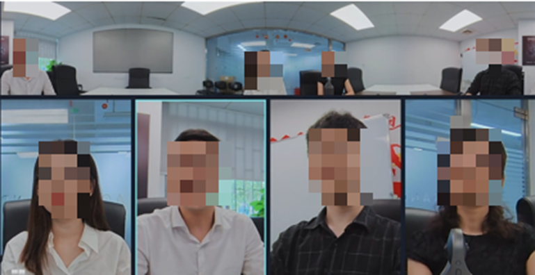

​	通常市面上的会议相机更多的是采用单个超广角摄像头，赛题要求我们实现多画面拼接，因此这也是我们设计的重点。（图为淘宝某品牌会议相机）

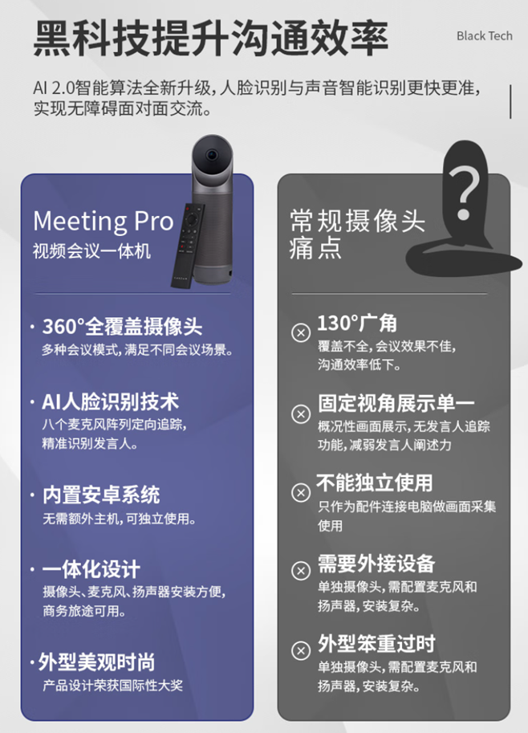

# 基础要求实现整体框图

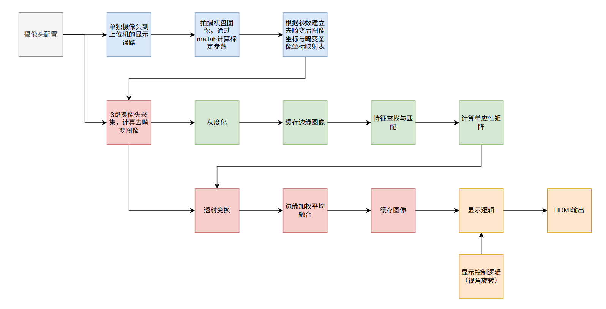

​	这里我们先给大家一个整体的工程框架，大家有了一个基本印象后再通过后面的讲解来填充这个框架。

​	蓝色方框为去畸变的预处理过程，可以单独写一个工程仅拍照上传用于计算内参，得到坐标映射表。

​	红色方框为视频数据流，去除畸变后再根据绿色方框计算的单应性矩阵完成投射变换，再做边缘融合后缓存。

​	橙色为画面输出的显示逻辑。

# 1 基础要求1

 同时获取多个摄像头图像，通过标定参数拼接到球面坐标或等距柱状投影，拼缝尽可能小。

---

## 	1.1 硬件分析

​	我们准备了三个广角OV5640摄像头，通过转接板接入底板接口，需要注意摄像头方向，尽可能涵盖更广的角度，且保证有视角的重叠区域，我们才能进行图像的拼接计算。同学们也可以考虑使用一块专门的图像采集板，通过网口或hdmi等接口将图像数据传入高云开发板进行后续拼接处理。

​	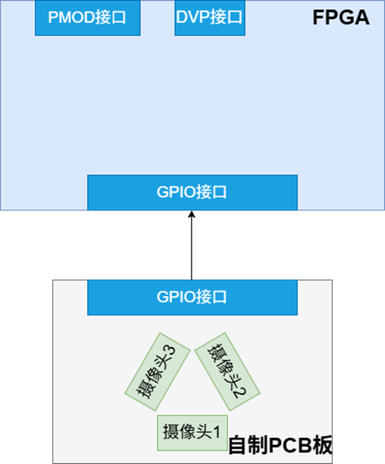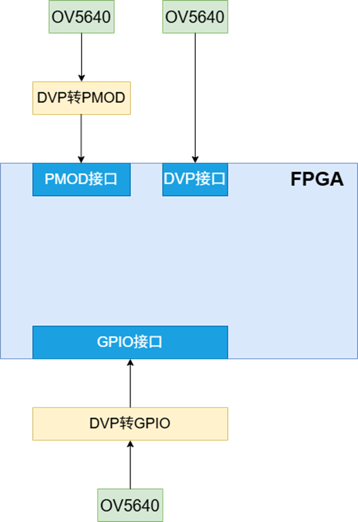    	

​	第一种是自己画一块带三个摄像头的模块，三个摄像头固定在PCB板上，要求每个镜头的视角大于120°，保证每个摄像头之间有重叠区域。第二种是用三个DVP接口的摄像头，DVP接口用的是FPC软排线，可以固定出三个不同角度的摄像头，需要准备转接板。第二种方式各摄像头位置不固定，可以灵活调节，但需要做好固定。

​	这里我们放上官方推荐的板卡底板参数，同学们也可以根据接口来进行设计[1]（详细参数请见官网，链接放于文末）

| 项目                  | 数量 | 备注                                              |
| :-------------------- | ---- | ------------------------------------------------- |
| LED                   | 4+8  | 4个电量指示灯+8个PMOD外接                         |
| WS2812                | 1    | 与 aRGB 灯带连接器同数据引脚                      |
| Buttons               | 3+1  | 3个用户按键+1个reconfig按键                       |
| PCIe                  | 1    | 4-lane @ 5Gbps，CH569 16bit HSPI                  |
| USB3                  | 2    | SuperSpeed @ 5Gbps                                |
| GbE                   | 1    | 千兆以太网                                        |
| DVI RX                | 1    | 与 DVI TX 互相占用                                |
| DVI TX                | 1    | 与 DVI RX 互相占用                                |
| PMOD                  | 2    | 与上边的40P排针和DVP复用                          |
| ADC                   | 2    | 2个差分输入通道                                   |
| aRGB CONN.            | 1    | 与 WS2812 同数据引脚                              |
| DVP Interface         | 1    | 与上侧的40P排针和PMOD复用                         |
| RGB Interface         | 1    | 支持 RGB888 屏幕                                  |
| MIC ARRAY Interface   | 1    | 支持连接 Sipeed 6+1 麦克风阵列                    |
| SD Slot               | 1    | 1-bit SDIO/MMC 或SPI模式                          |
| BATT CONN.            | 1    | 支持3.7V锂电池，自带充放电管理                    |
| PWM FAN CONN.         | 1    | 支持5V PWM风扇，支持测速                          |
| Speaker CONN.         | 2    | 支持两个3W扬声器                                  |
| 3.5mm Headphone CONN. | 1    | 立体声输出，无Mic                                 |
| MS5351                | 1    | 为 Serdes 提供 RefClk；通过底板上的串口来控制输出 |
| USB JTAG & UART       | 1    | 支持烧录 FPGA，并且提供串口功能                   |
| 40P 排针              | 2    | 上侧的40P排针与PMOD和DVP复用                      |
| 电源开关              | 1    | 长按2s切换开关机状态                              |
| 12V DC                | 1    | 规格DC5521                                        |

​	下图为赛题推荐板卡**138k与60k**核心板资源的比较，同学们可以根据需要进行选择。

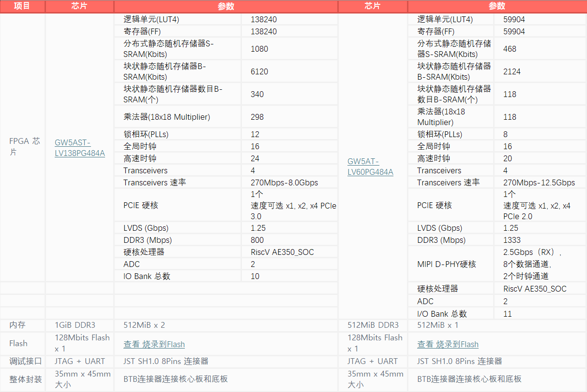

## 	1.2 广角畸变校正

​	由于广角/鱼眼镜头的几何光学特性，将画面投影到摄像头cmos上时不可避免的出现**桶形畸变**（Barrel Distortion），图像边缘向外膨胀，可想而知相邻的广角摄像头同样会出现畸变，而在畸变图像上进行拼接难度过大，因此，我们需要将其先恢复为**透视投影**，即图像中直线仍保持直线，再去做拼接；

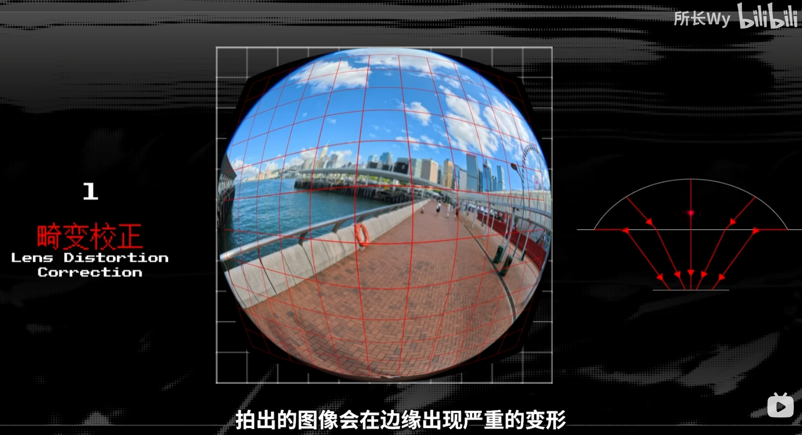

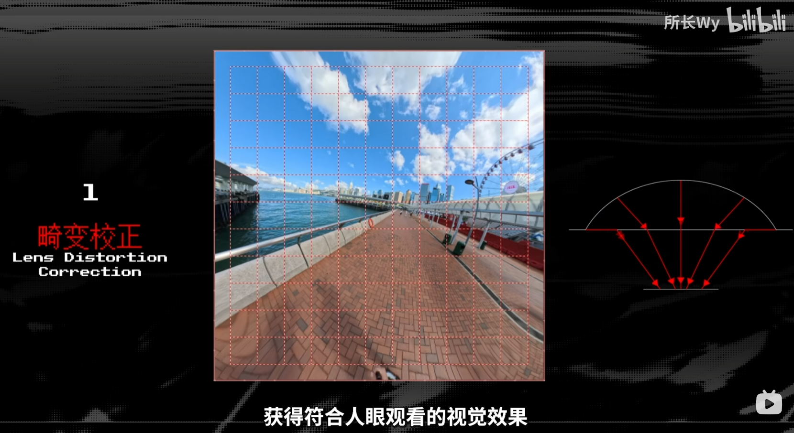

​	镜头畸变常用的数学模型是Brown-Conrady模型，将畸变分为径向畸变和切向畸变，这里我们不深入展开，感兴趣的同学可以自行学习，通过标定可以计算出畸变的系数，利用畸变系数对图像反向映射即可得到校正后的图像。

​	标定通常采用张正友标记法，简而言之，用摄像头拍摄若干已知格子大小的棋盘图，通过模型公式可以计算出摄像头的内参。我们可以直接使用matlab的相机校正工具分析摄像头拍摄的棋盘图得到内参参数[2]，然后计算畸变校正的映射表并存储在FPGA的BRAM中，实时查表校正，避免占用过多资源用于计算。

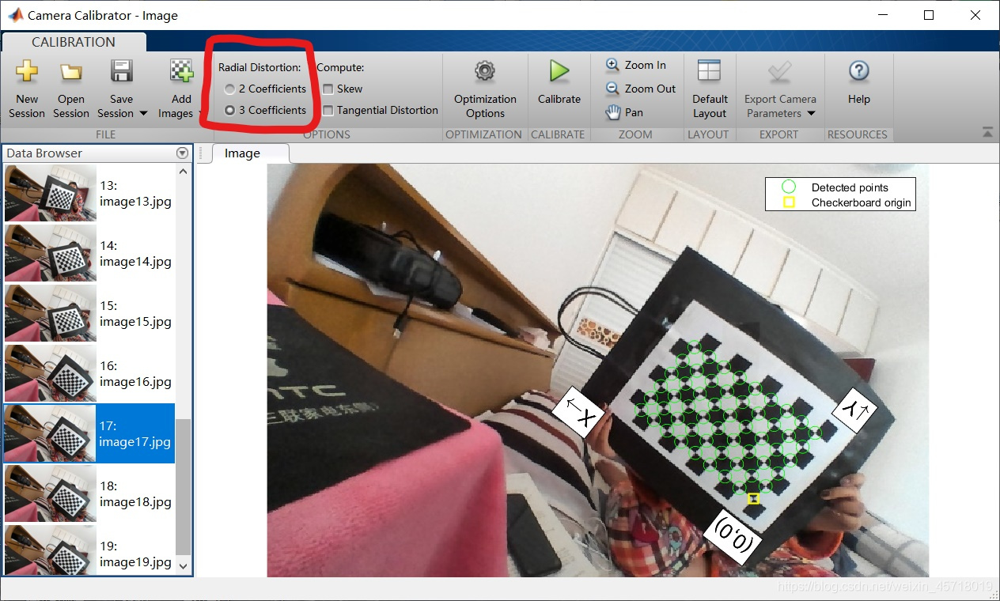

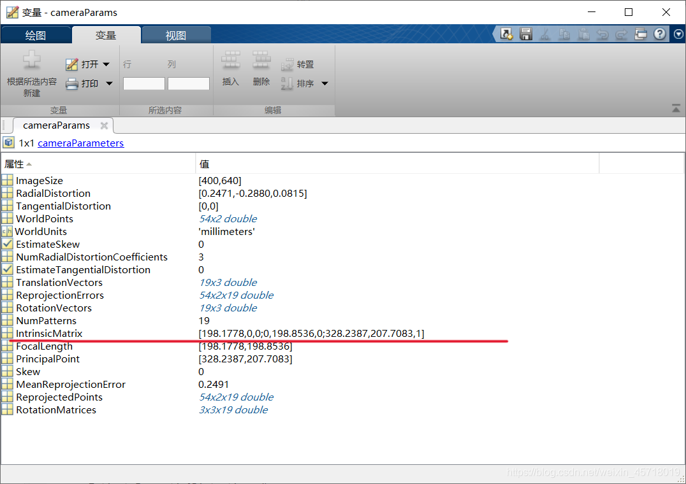

## 	1.3 特征匹配与拼接

​	得到校正后的图像后就开始准备拼接，拼接前，需要寻找图像中的特征点，而我们的应用场景为会议相机，相机组在同一水平面，只有左右边缘存在重叠现象，因此只需要在两个摄像头采集图像的重复区域中寻找特征点；什么是特征点？特征点即有图像中有代表性的点，具有像素变化大、像素梯度大的特点，性质上具有尺度不变性、亮度不变性、旋转不变性。这里我们会议相机拍摄的图像之间不存在明显尺度变化、亮度变化、旋转变化，因此在特征检测算法的实现上可以不用考虑这三种性质，从而对算法做出一定优化。

### 	1.3.1 特征点检测

​	ORB（Oriented FAST and Rotated BRIEF）是一种快速特征点提取和描述的算法。ORB算法分为两部分，分别是特征点提取和特征点描述。特征提取是由FAST（Features from  Accelerated Segment Test）算法发展来的，特征点描述是根据BRIEF（Binary Robust Independent Elementary Features）特征描述算法改进的。ORB特征是将FAST特征点的检测方法与BRIEF特征描述子结合起来，并在它们原来的基础上做了改进与优化。ORB算法的速度是sift的100倍，是surf的10倍。[3]

​	FAST属于角点检测的范畴，适用于需要进行角点检测的应用领域。该算法的定义为：在某像素点的周围选取一个邻域，该邻域为圆形区域，把该点与圆形区域内的点进行灰度值的比较，若符合比较的条件，则该点就可作为特征点[4]。FAST还可以优化为oFAST算法：1、特征计算的简化：仅计算1,5,9,13点与中心点差异是否大于阈值，超过3个点认为是特征；2、非最大值抑制：即找最大值，对每个特征点计算与周围一圈点的累计差值，一定范围内仅保留最大累计差值的特征点，简化后续计算；

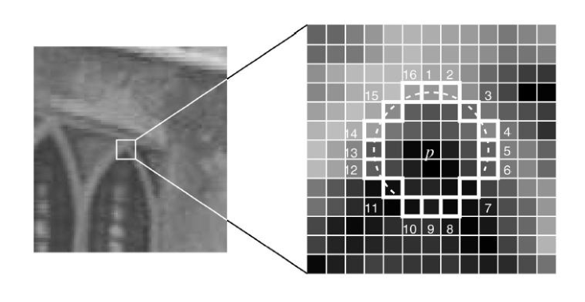

​	

### 	1.3.2 特征点匹配

​	找到两图重叠区域的特征点后，则需将特征点进行匹配。BRIEF算法计算出来的是一个二进制串的特征描述符。它是在一个特征点的邻域内，随机选择n对像素点pi、qi（i=1,2,…,n），随机方式如下图，然后比较每个点对的灰度值的大小。如果I(pi)> I(qi)，则生成二进制串中的1，否则为0。所有的点对都进行比较，则生成长度为n的二进制串。一般n取128、256或512，opencv默认为256。另外，值得注意的是为了增加特征描述符的抗噪性，算法首先需要对图像进行高斯平滑处理。在特征点SxS的区域内选取点对时，当*p*和*q*都符合图Ⅲ中高斯分布时匹配结果最好。再将两图特征点一一比较汉明距离（对两个字符串进行异或运算，并统计结果为1的个数，那么这个数就是汉明距离），距离越小，说明两者相似度越高。

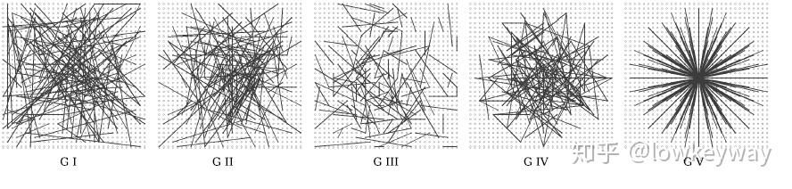

​	两图中特征点汉明距离相近则说明为同一点，找到至少4个匹配点后可以计算得到单应性矩阵[5]，应用单应性矩阵将第二个图透射到第一个图的坐标下，完成拼接。

### 	1.3.3 单应性矩阵的应用

​	在**欧式空间**中，同一平面的两条平行线不能相交；在**透视空间**中，两条平行线可以相交，火车轨道随着我们的视线越来越窄，最后两条平行线在无穷远处交于一点；欧式空间描述2D/3D几何非常合适，但这种方法不适合处理透视空间的问题。

​	单应性Homography，在计算机视觉领域中，单应性是非常重要的一个概念，在图像拼接、ar增强现实等应用中非常重要。单应性矩阵可以让一个视角的图像通过透射（projection）变换到另外一个视角。

​	通过升维引入齐次坐标，图像的平移、旋转等操作可以统一为矩阵乘法，将图像从2d坐标变成3d坐标，以后所有的变换，不管怎样变换，变换多少次，都可以表示成一连串的矩阵相乘了。

​	仿射变换是透视变换的特例，矩阵参数中只涉及6个参数，整体控制了图像的旋转、平移、缩放、错切（平行四边形），平行线变换后仍平行。[6]

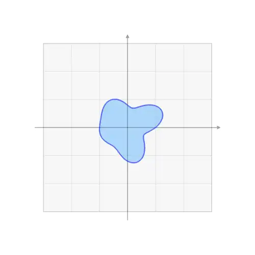

​	透射变换，将h33固定为1，坐标归一化后共8个参数，实现除了仿射变换的效果外，还有模拟3d视角的效果，类似近大远小，变换后平行线可能相交于消失点；

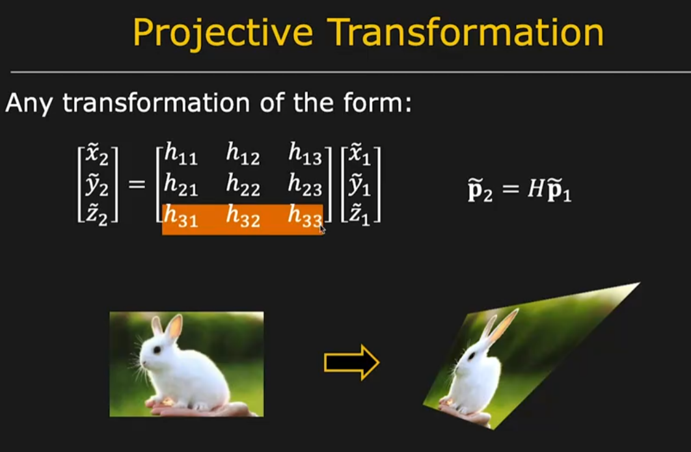

### 	1.3.4 图像变换

​	原图像素变换到新坐标下不一定与实际像素点对齐，无法将变换后的像素值分配到周围实际像素。但反过来，已知像素点坐标去求逆变换的坐标，则可以通过对逆变换对应的坐标周围的像素点进行双线性插值等算法来得到一个具体的像素值。

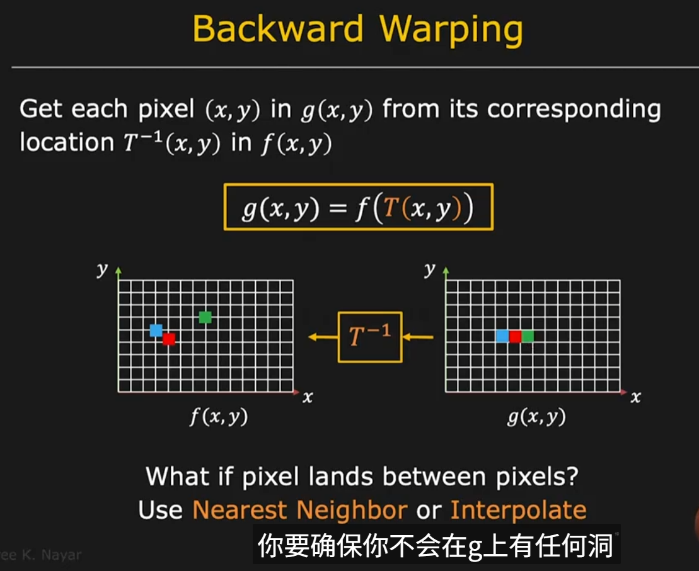

​	实现cam1和cam2、cam1和cam3的对齐后，360度环形全景下2和3之间可能仍会存在缝隙，这是由于2和3计算单应性矩阵均以1为参考完成投影，进一步优化相对较难，因此不考虑2和3之间拼接显示，仅在下图示意的范围内显示。

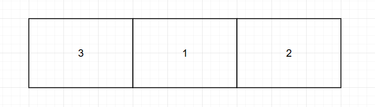

### 	1.3.5 图像融合

直接拼接可能出现颜色过渡不自然的问题，如下图所示。为了让两图可以融合得更好，可以采用线性渐变融合消除拼接缝（Seam）

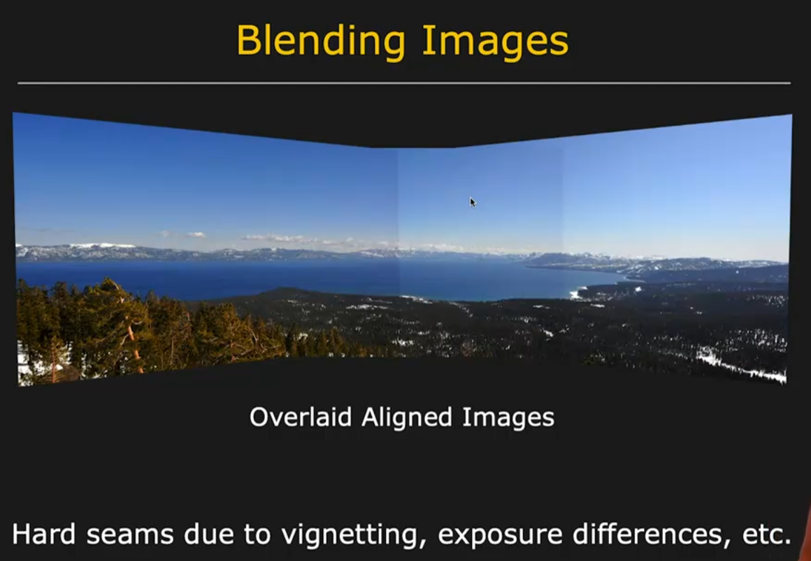

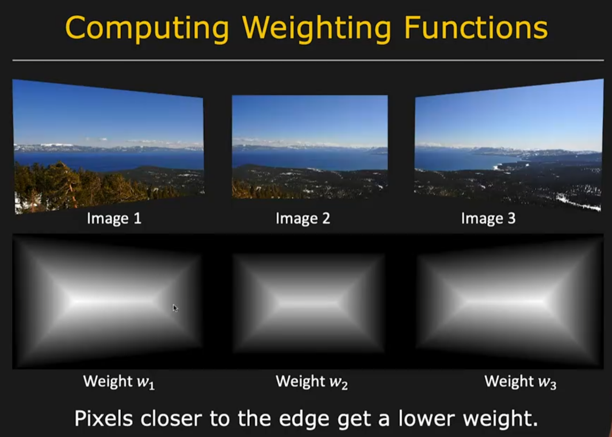

​	具体操作为通过在图像的重叠部分应用权重函数（如上图）来实现平滑过渡，权重通常是根据距离边缘的距离来确定的，如上图。加权平均操作简单且高效，适用于大多数基本的图像拼接需求，尽管可能不如一些更复杂的缝合方法那样精确，但它的计算效率更高。

# 	2 基础要求2	

通过按键或其它输入设备可以进行视角旋转，将实时解算的矩形画面呈现到HDMI显示器上。

---

​	完成拼接后我们得到一张全景图，这里有两种选择去进行后续显示：一是根据控制选择的窗口去缓存全景图中对应的部分到ddr3中，显示逻辑根据输出视频的时序按顺序读出即可；二是缓存整个全景图，根据控制窗口去读出对应ddr3地址中的数据。

​	基础要求二的输入方式，我们需要通过按键或其它输入设备可以进行视角旋转，将实时解算的矩形画面呈现到 HDMI显示器上 。有多种输入控制方式，既可以通过板载物理按键进行直接操控，也可以借助红外遥控、蓝牙模块实现无线控制，同时还可以用串口通信接口、串口屏，便于通过外部设备发送控制指令，甚至可以写个上位机再用串口进行交互都可以。市场上的全景会议相机由于要接线少、使用方便，一般采用的是遥控器的方案。

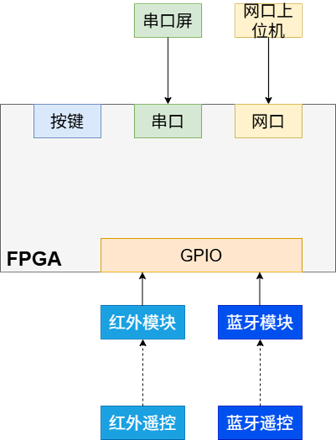

# 3 拓展要求1

实时解算的矩形画面通过 USB 或网口进行传输，实现全景 UVC 摄像头或全景网络摄像头

---

​	该要求与基础要求2类似，只不过一个是将图像数据给到显示模块，一个是将图像数据给到传输模块。开发板板usb3.0支持5Gb/s，网口支持千兆网，开发难度上来说以太网更简单，不过应根据带宽实际需求来选择。假设传输完整全景图，即1080p@60fps下数据量为`1920*1080*60*2BYTE(RGB565) = 248,832,000byte/s`，千兆网使用udp包传输的有效数据的理论带宽为120MB/s左右，usb3.0的有效数率为 400~440 MB/s，usb3.0满足实时全景图传输，因此可以从3个方面考虑：

1. 使用更低分辨率；
2. 使用更低帧率；
3. 压缩编码传输：考虑到会议实时性可以选用AV1或H.264编码，这些成熟的编码方案可以在网上找到开源方案。编码方案内存可能会比较吃紧。

# 4 拓展要求2

可以搭配麦克风阵列，实现自动旋转视角到说话人角度的虚拟云台功能

---

​	这个对应着基础要求二的视角旋转，达到虚拟云台的效果。主流声源定位算法是时延定位，需要计算两路声源的互相关函数，波峰在序列出现的位置就是两路声源到达的时间差，再根据麦克风排列的几何位置可以推算出声源的角度。

​	下图为sipeed的麦克风阵列

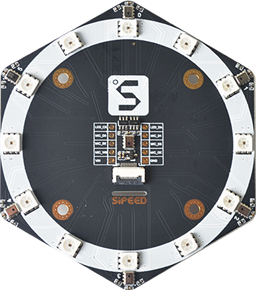

​	目标信号都来自于**同一个声源**，因此各通道信号相关性较强，计算每两路信号之间的相关函数，确定两个麦克风观测信号之间的时延。

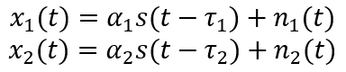

采用互相关算法做延时估计：

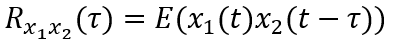

得出：

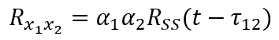

**虚拟云台**：通过**自动视角旋转**实现摄像头不旋转而画面旋转的功能

实现步骤：

1.声源定位：判断**说话人位置**

2.计算偏移量：计算当前位置和说话人位置的**偏移量**

3.自动视角旋转：将偏移量传输至基础要求2模块实现视角旋转

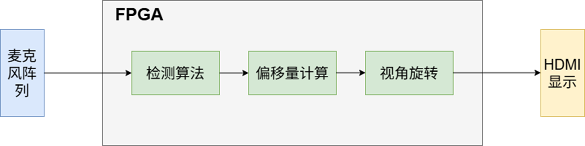

# 5 拓展要求3

除了视角旋转外，也可以实现视角缩放功能，实现类似"小行星"的特效

---

​	"小行星"特效：该特效的实现需要先实现球面坐标投影。由于之前使用的是等柱状投影的呈现方式，因此缩放后需按照经纬展开法重新贴到球面。接下来，需要一种下面这样的投影。将一个球面上的坐标投影到平面上。投影中心在球心到球面之间。[7]

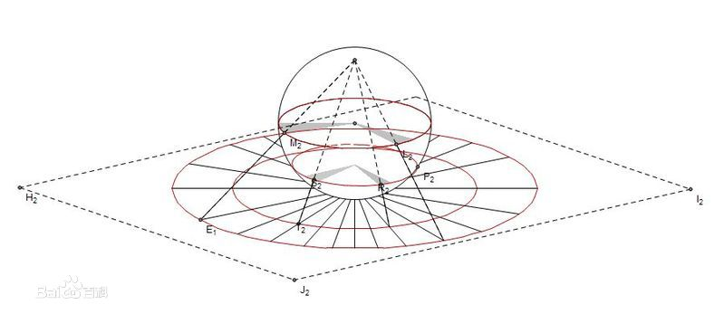

​	这种投影方式中，下半球面会全部投影在平面图中的一个圆内，上半球面会全部投影到圆的外面，并且分布越来越稀疏。

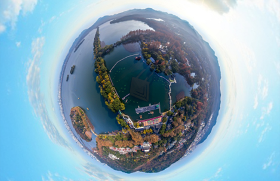

# 6 拓展要求4

其他实际意义功能

---

​	拓展要求四是有其它具有实际意义的功能，其实就是实现其他功能再结合本次赛题的功能，将这个系统改造成多功能的系统。可以参照市场上有的全景会议相机添加功能，比如加上SD卡录制会议视频功能或者增加其他显示模式（讨论、全局、演讲、巡航模式）都可以。又比如增加陀螺仪的控制，使用陀螺仪模块，实时将陀螺仪信息回传到fpga开发板显示模块，fpga根据陀螺仪参数解算出位置信息，显示对应画面，类似vr的效果。

​	更多实用功能就留给同学们头脑风暴。

# 7 学习路线

​	最后，我们也给大家整理了大致学习路线以及参考资料，更具体的学习路线欢迎关注私信后台领取。

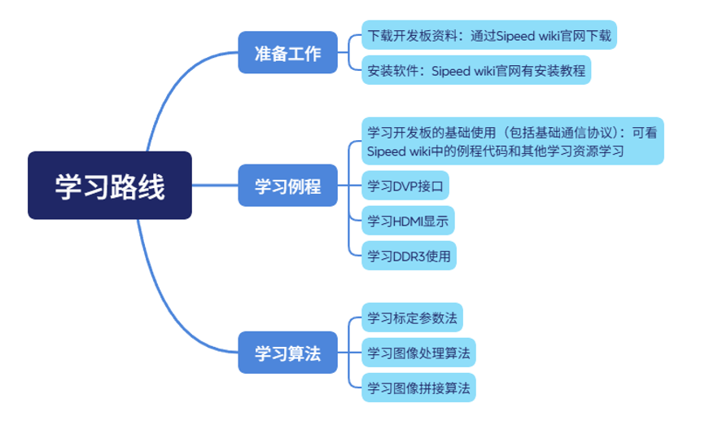

# 参考资料

[1] Tang Mega 60K板卡介绍[Tang Mega 60K Dock - Sipeed Wiki](https://wiki.sipeed.com/hardware/zh/tang/tang-mega-60k/mega-60k.html)

[2] [使用Matlab做相机标定（获取相机的内外参数矩阵）_matlab相机标定结束后如何显示图片的平移矩阵-CSDN博客](https://blog.csdn.net/weixin_45718019/article/details/105823053)

[3] [ORB特征详解-CSDN博客](https://blog.csdn.net/zouzoupaopao229/article/details/52625678)

[4]李东辉.鱼眼镜头下基于 ORB 算法的图像拼接技术研究[D]桂林理工大学,2017

[5] [（超详细）张正友标定法原理及公式推导_(超详细)张正友标定法原理及公式推导-CSDN博客](https://blog.csdn.net/qq_40918859/article/details/123858949)

[6] [图像拼接 单应性计算 图像转换 ||The Pipline of Image Stitching_哔哩哔哩_bilibili](https://www.bilibili.com/video/BV1hi421R7Vt/?vd_source=eb7e1731c8a64009c7278d24d1b1564c)

[7] [全景图转小行星视角投影原理详解 - 一度逍遥 - 博客园](https://www.cnblogs.com/riddick/p/9937729.html)

推荐学习

[FPGA、由算法到RTL设计、第一节、任意比例缩放、双线性插值算法_哔哩哔哩_bilibili](https://www.bilibili.com/video/BV1yb421H7qV/?spm_id_from=333.337.search-card.all.click&vd_source=eb7e1731c8a64009c7278d24d1b1564c)

[2020年中国科学技术大学《计算机图形学》本科课程（刘利刚）](https://www.bilibili.com/video/BV1iT4y1o7oM?t=4301.2&p=2)

[[开源项目\]基于FPGA的视频图像拼接融合-腾讯云开发者社区-腾讯云](https://cloud.tencent.com/developer/article/2016194)

[[计算机视觉\] 什么是齐次坐标？为什么要引入齐次坐标？-CSDN博客](https://blog.csdn.net/wangmj_hdu/article/details/119143771)

